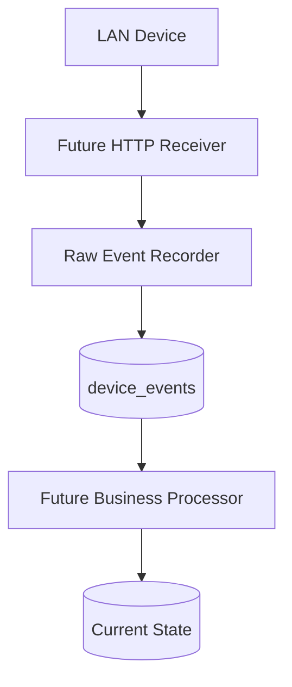

# Architecture

## Event Processing Pipeline

CockpitConsole decouples the ingestion of events from the processing of business logic.

**Key Principle**: `Event ingestion` != `Business processing`.
Events are safely committed to the database independently of dashboard state or batch logic.
