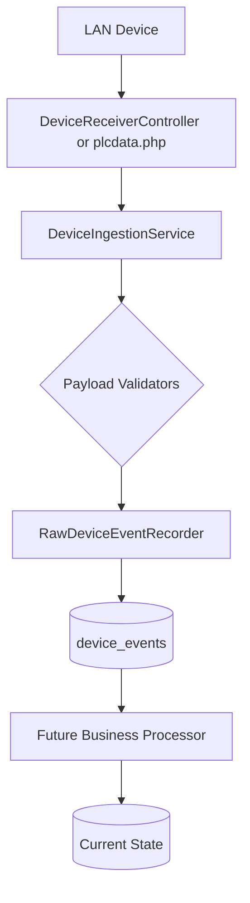

# Architecture

## Event Processing Pipeline

CockpitConsole decouples the ingestion of events from the processing of business logic.

**Key Principle**: `Event ingestion` != `Business processing`.
Events are safely committed to the database independently of dashboard state or batch logic.
The HTTP receivers acknowledge only after the raw event is durably committed to the `device_events` table.

## Authentication Architecture
Authentication is decoupled from traditional HTTP sessions. eSSL device events are parsed by FingerprintEventProcessor to authorize a physical Terminal rather than a browser session. See [AUTHENTICATION.md](AUTHENTICATION.md) for details.

## Phase 5: PLC Processing Flow
1. **HTTP Ingestion**: \plcdata.php\ receives raw JSON -> logs exactly to \device_events\ -> returns 200 OK.
2. **Business Processing**: \PlcRequestProcessor\ (which can run synchronously or via Messenger background queues) picks up the raw \plc\ event.
3. **Event Generation**: The processor validates the event, writes an idempotent \
equest_events\ record, and increments \cockpit_state\ using pessimistic database row locks for safety.

## Phase 6: Production Processing Flow
1. **HTTP Ingestion**: \plcdata.php\ receives raw JSON -> logs exactly to \device_events\ -> returns 200 OK.
2. **Business Processing**: \Scanner1ProductionProcessor\ picks up the raw \scanner1\ event.
3. **Event Generation**: The processor validates the event, maps the model, writes an idempotent \production_events\ record, and decrements \current_balance\ while incrementing \	otal_produced\ using pessimistic database row locks for safety.

## Phase 7: FIFO Production Flow
1. **Shortage Detection**: \PlcRequestProcessor\ creates a \ProductionQueue\ entry on shortage.
2. **FIFO Selector**: \FifoQueueService\ uses Doctrine \ORDER BY\ to pick the next oldest shortage.
3. **Current/Next**: System explicitly tracks one \in_production\ cockpit and one \
ext\ cockpit.
4. **Resolve Shortage**: \Scanner1ProductionProcessor\ resolves the active queue entry upon production.
All states are database-driven to survive apache restarts and browser closures.

## Phase 8: Final Inventory Flow
PLC -> Total Requested (Demand)
Scanner1 -> Total Produced (Supply)
Scanner2 -> Total Dispatched (Outbound)
- **Balance** = Requested - Produced
- **Available** = Produced - Dispatched
