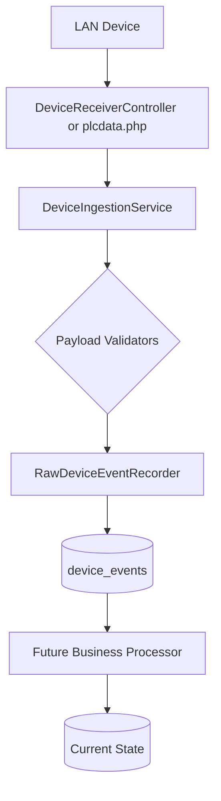

# Architecture

## Event Processing Pipeline

CockpitConsole decouples the ingestion of events from the processing of business logic.

**Key Principle**: `Event ingestion` != `Business processing`.
Events are safely committed to the database independently of dashboard state or batch logic.
The HTTP receivers acknowledge only after the raw event is durably committed to the `device_events` table.

## Authentication Architecture
Authentication is decoupled from traditional HTTP sessions. eSSL device events are parsed by FingerprintEventProcessor to authorize a physical Terminal rather than a browser session. See [AUTHENTICATION.md](AUTHENTICATION.md) for details.
