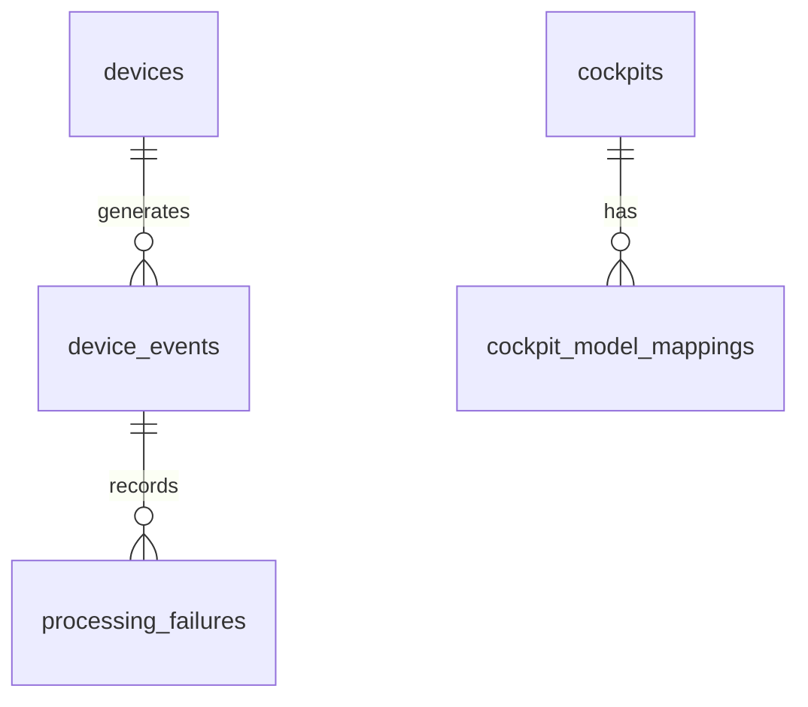

# Database Foundation

This document details the database foundation and schema architecture for CockpitConsole.

## Core Principles
1. **Append-Only Journal**: The system relies on a durable append-only event journal (`device_events`).
2. **Immutability**: Raw payloads and original event metadata must not be mutated after recording.
3. **Determinism**: Time handling preserves microsecond precision for deterministic sorting.

## Tables

### 1. `devices`
Master registry for all hardware devices communicating with the system.
- `id` (INT, PK)
- `device_code` (VARCHAR, UNIQUE)
- `device_type` (VARCHAR)
- `ip_address` (VARCHAR)
- `is_active` (BOOLEAN)

### 2. `cockpits`
Master list of production cockpits.
- `id` (INT, PK)
- `cockpit_code` (VARCHAR, UNIQUE)
- `is_active` (BOOLEAN)

### 3. `cockpit_model_mappings`
Maps scanner models to their respective cockpits without hardcoding.
- `id` (INT, PK)
- `cockpit_id` (INT, FK -> cockpits)
- `scanner_model` (VARCHAR, INDEX)
- `mapping_type` (VARCHAR)

### 4. `device_events`
The critical, append-only raw event journal.
- `id` (BIGINT, PK) - Monotonic sequence.
- `event_uuid` (VARCHAR, UNIQUE) - Globally unique identifier.
- `device_id` (INT, FK -> devices, Nullable)
- `source_type` (VARCHAR) - Origin of the event.
- `received_at` (DATETIME(6)) - Microsecond precision timestamp for server reception.
- `raw_payload` (JSON) - Unaltered original message.
- `payload_hash` (VARCHAR) - SHA-256 hash of the payload for duplicate detection.
- `processing_status` (VARCHAR, INDEX) - Current state (e.g., received, processed, failed).

### 5. `processing_failures`
Persistent storage for event processing failures.
- `id` (INT, PK)
- `device_event_id` (BIGINT, FK -> device_events)
- `failure_type` (VARCHAR)
- `message` (TEXT)
- `attempt_number` (INT)

### 6. `audit_events`
Foundation for tracking significant application actions.
- `id` (INT, PK)
- `event_type` (VARCHAR, INDEX)
- `actor_type` (VARCHAR)

## Entity Relationship Diagram

## Migration Policy
All schema changes MUST be executed via Doctrine Migrations. Manual schema modifications outside of migration files are strictly prohibited.
